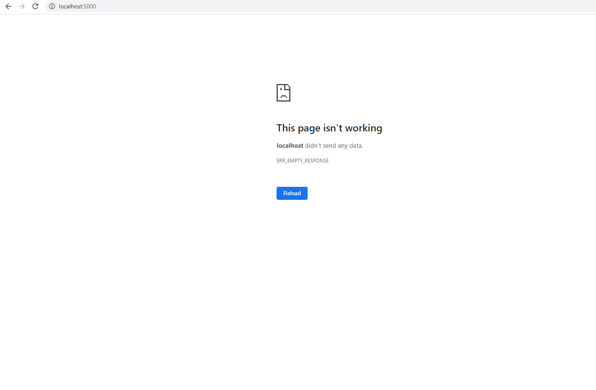

# ECE444-F2023-Lab3
### Cynthia Hu
This repo is a clone of 
https://github.com/miguelgrinberg/flasky.

#### Activity 1: create and push new branch for Lab 3
This is a branch dedicate towards lab 3

#### Activity 2: Docker Installation
Docker Desktop has been installed succsuessfully

#### Activity 3: Edit Title
Before input name and email

After input name and email

#### Activity 4: Building and running the docker image locally
the container is running

have trouble with deploying with docker, the image created succuessfully and the container is running without any issue

[Alt text](ScreenShot/Activity4_lab3_docker_deloy_problem2.png)

