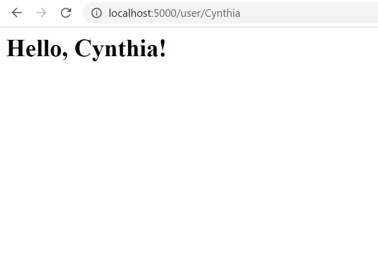

# ECE444-F2023-Lab1
### Cynthia Hu
this repo is a clone of 
https://github.com/miguelgrinberg/flasky.

#### Activity 1：Installation

#### Activity 2: replay chapter 2 exmaple
launch example 2-1 in virtual environment

commit of example 2-1

launch example 2-2 in virtual environment

commit of example 2-2

#### Activity 3: replay and modify chapter 3 exmaple
chapter 3 example modified

commit of chapter 3 exmaple

